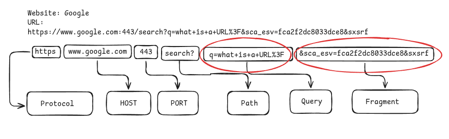
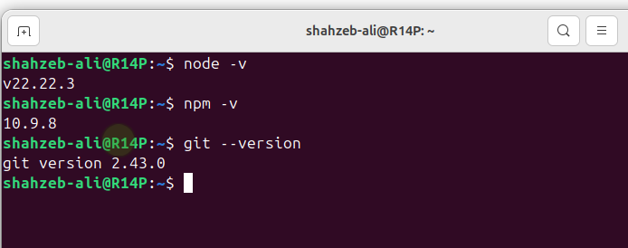
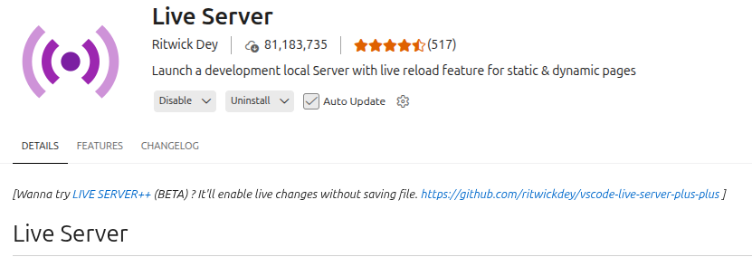
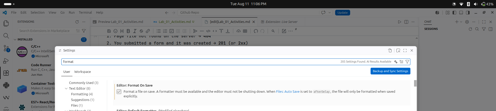
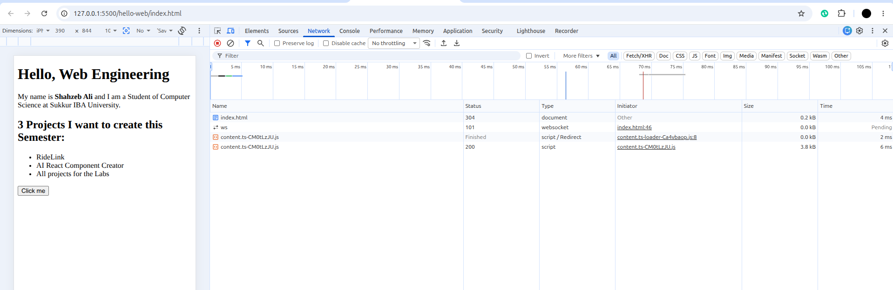

# Lab 01: Activity Tasks

## Activity A:

**App:** WhatsApp Web

1. **What Client do:** Renders the chat UI — messages, typing indicator, emoji picker, and type/scroll without needing to contact the server for every keystroke.
2. **What Server must do:** Stores our messages, verifies our login session, and routes each message to the correct recipient's device.
3. **What breaks if the network fails mid-load:** New messages get stuck with a clock/pending icon and never actually send; incoming messages stop arriving; the chat list can freeze on stale/outdated data until the connection comes back.

## Activity B:

## Activity C:

Instructor or neighbour calls out a situation. You answer with a status family or code:

1. Page file not found on the server → **404**
2. You submitted a form and it was created → **201** (or **2xx**)
3. Server crashed while handling your request → **5xx**
4. You are not logged in to a private page → **401** (or **403** if authenticated but not allowed)

## Activity D:

confirmation of tools installation.

Live server is installed:

format on save is on:

## Activity E:

Activity E is perfomed and can be seen inside the folder.

## Activity F:

Network (Status 200 confirmation):

* **Console:** I typed `document.title` and got the page title. Then I called `notARealFunction()`, which produced a red error because the function does not exist or is not defined in the page.
* **Elements:** I changed the `<h1>` text directly in DevTools. After reloading the page, the change disappeared because DevTools only changes the webpage temporarily in the browser; it does not modify the actual `index.html` file.
