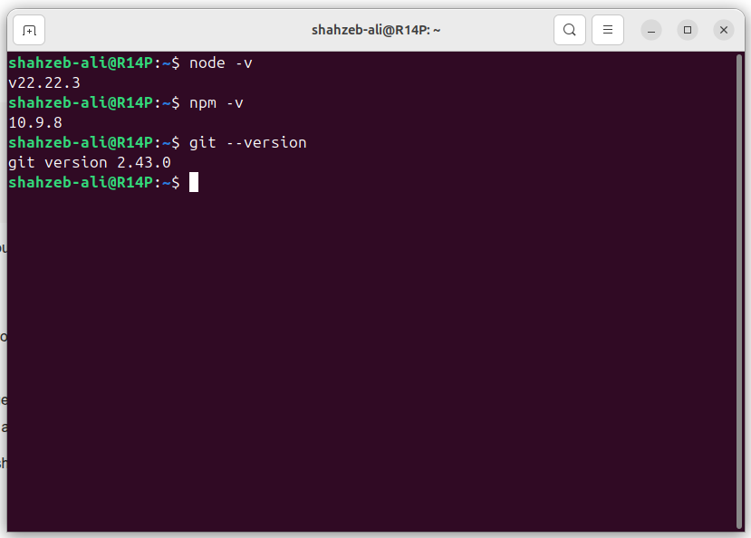
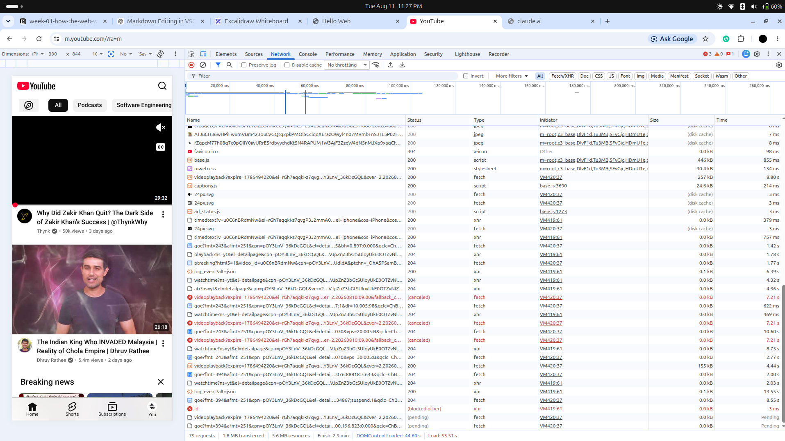

# Lab 01 Home Work Tasks:

## Task 1 — Prove the toolchain

## Task 2 — Network detective (hands-on)

1. The page made **68 requests**.
2. The largest file shown is **`base.js`**, which is a **JavaScript file**. Its size is about **446 kB**.
3. One request that was not `200` is the **`id`** request, which shows **`(blocked:other)`**. I think the browser blocked this request for some reason, so it was not successfully completed.
